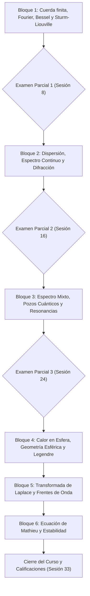

# 🗺️ Map of Content (MoC) — Matemáticas Avanzadas de la Física

Bienvenido al mapa general de contenidos para el curso **Matemáticas Avanzadas de la Física (MAF)** en la Facultad de Ciencias, UNAM. Este mapa interconecta las 33 sesiones del curso, los conceptos teóricos, las funciones especiales y los laboratorios computacionales.

---

## 🧭 Estructura General del Curso (6 Bloques Temáticos)

---

## 📦 Bloque 1: Cuerda Finita, Series de Fourier y Operadores de Sturm-Liouville (Sesiones 1 a 7)

- **Sesiones**:
  - [[Lectures/Sesion_01_Presentacion_Cuerda_Vibrante|Sesión 1: Presentación, Cuerda Vibrante y Separación de Variables]]
  - [[Lectures/Sesion_02_Series_Fourier|Sesión 2: Series de Fourier y Desarrollo de Funciones]]
  - [[Lectures/Sesion_03_Sturm_Liouville|Sesión 3: Problema General de Sturm-Liouville y Bases Completas]]
  - [[Lectures/Sesion_04_Membranas_Circulares_Bessel|Sesión 4: Membranas Circulares e Introducción a Funciones de Bessel]]
  - [[Lectures/Sesion_05_Propiedades_Bessel|Sesión 5: Propiedades Nodales, Soluciones Singulares y Orden Fraccionario]]
  - [[Lectures/Sesion_06_Series_Fourier_Bessel|Sesión 6: Membranas Sectoriales y Series de Fourier-Bessel en Julia/Python]]
  - [[Lectures/Sesion_07_Funciones_Green_1D|Sesión 7: Operadores Inversos, Función de Green 1D y Delta de Dirac]]
  - **Sesión 8**: 🎯 **Examen Parcial 1** *(Formulario manuscrito +1 pt)*
- **Conceptos Teóricos**:
  - [[Concepts/Bloque_01/Cuerda_Vibrante_Separacion_Variables|Cuerda Vibrante y Separación de Variables]]
  - [[Concepts/Bloque_01/Series_Fourier|Series de Fourier y Ortogonalidad]]
  - [[Concepts/Bloque_01/Problema_Sturm_Liouville|Operadores y Problema de Sturm-Liouville]]
  - [[Concepts/Bloque_01/Funciones_Bessel|Funciones de Bessel ($J_\nu, Y_\nu$)]]
  - [[Concepts/Bloque_01/Series_Fourier_Bessel|Series de Fourier-Bessel]]
  - [[Concepts/Bloque_01/Funcion_Green_1D|Funciones de Green 1D y Distribuciones]]
- **Laboratorio**:
  - `Notebooks/Python/01_Fourier_Bessel_Series.ipynb`

---

## 🌊 Bloque 2: Vibración, Dispersión en Regiones Infinitas y Espectro Continuo (Sesiones 9 a 15)

- **Sesiones**:
  - [[Lectures/Sesion_09_Cuerda_Semiinfinita_Espectro_Continuo|Sesión 9: Cuerda Semiinfinita y Ondas Incidentes/Reflejadas]]
  - [[Lectures/Sesion_10_Transformadas_Fourier_Continuo|Sesión 10: Funciones Propias Generalizadas y Límite al Continuo]]
  - [[Lectures/Sesion_11_Reflexion_Olas_Integrales_Complejas|Sesión 11: Reflexión de Olas e Integrales Complejas de Bessel]]
  - [[Lectures/Sesion_12_Asintotica_Bessel_Espectro_Continuo|Sesión 12: Asintótica de Bessel y Representación Espectral]]
  - [[Lectures/Sesion_13_Difraccion_Cilindro_Bessel_Modificadas|Sesión 13: Difracción EM por Cilindro y Bessel Modificadas ($I_\nu, K_\nu$)]]
  - [[Lectures/Sesion_14_Difraccion_Rayleigh|Sesión 14: Difracción de Rayleigh y Sección Eficaz]]
  - [[Lectures/Sesion_15_Taller_Difraccion_Dispersion|Sesión 15: Taller Computacional de Difracción y Dispersión]]
  - **Sesión 16**: 🎯 **Examen Parcial 2**
- **Conceptos Teóricos**:
  - [[Concepts/Bloque_02/Cuerda_Semiinfinita_Espectro_Continuo|Espectro Continuo y Cuerda Semiinfinita]]
  - [[Concepts/Bloque_02/Transformada_Fourier_Continuo|Transformada de Fourier como Límite Espectral]]
  - [[Concepts/Bloque_02/Asintotica_Bessel_Integrales_Complejas|Representación Integral y Asintótica de Bessel]]
  - [[Concepts/Bloque_02/Difraccion_Cilindro_Bessel_Modificadas|Difracción Cilíndrica y Bessel Modificadas]]
  - [[Concepts/Bloque_02/Difraccion_Rayleigh_Seccion_Eficaz|Difracción de Rayleigh y Sección Eficaz]]

---

## ⚛️ Bloque 3: Espectro Mixto en Mecánica Cuántica y Clásica (Sesiones 17 a 23)

- **Sesiones**:
  - [[Lectures/Sesion_17_Pozo_Potencial_Estados_Ligados_Libres|Sesión 17: Pozo Cuántico: Estados Ligados vs Estados Libres]]
  - [[Lectures/Sesion_18_Representacion_Espectral_Mixta|Sesión 18: Representación Espectral Mixta (Suma + Integral)]]
  - [[Lectures/Sesion_19_Potenciales_Reflexion_Cero_Solitones|Sesión 19: Potenciales Reflexión Cero y Solitones (KdV)]]
  - [[Lectures/Sesion_20_Ondas_Elasticas_Acopladas|Sesión 20: Ondas Elásticas Acopladas y Medios Vibrantes]]
  - [[Lectures/Sesion_21_Atrapamiento_Energia_Resonancias|Sesión 21: Atrapamiento de Energía y Resonancias]]
  - [[Lectures/Sesion_22_Amortiguamiento_Radiacion_Polos_Resolvente|Sesión 22: Amortiguamiento por Radiación y Polos del Resolvente]]
  - [[Lectures/Sesion_23_Hito_Proyecto_Final|Sesión 23: Hito de Proyecto Final (Revisión Intermedia)]]
  - **Sesión 24**: 🎯 **Examen Parcial 3**
- **Conceptos Teóricos**:
  - [[Concepts/Bloque_03/Pozo_Potencial_Estados_Ligados_Libres|Estados Ligados y Estados del Continuo]]
  - [[Concepts/Bloque_03/Representacion_Espectral_Mixta|Teoría Espectral Mixta]]
  - [[Concepts/Bloque_03/Potenciales_Reflexion_Cero_Solitones|Potenciales Pöschl-Teller y Solitones]]
  - [[Concepts/Bloque_03/Resonancias_Polos_Resolvente|Polos del Operador Resolvente y Resonancias]]

---

## 🌍 Bloque 4: Calor en la Tierra, Geometría Esférica y Legendre (Sesiones 25 a 28)

- **Sesiones**:
  - [[Lectures/Sesion_25_Conduccion_Calor_Esfera|Sesión 25: Conducción de Calor en la Tierra]]
  - [[Lectures/Sesion_26_Polinomios_Armonicos_Ecuacion_Legendre|Sesión 26: Polinomios Armónicos y Ecuación de Legendre]]
  - [[Lectures/Sesion_27_Propiedades_Ortogonalidad_Legendre|Sesión 27: Propiedades, Ortogonalidad y Asintótica de Legendre]]
  - [[Lectures/Sesion_28_Concentracion_Calor_Astrofisica|Sesión 28: Concentración de Calor y Aplicaciones Geofísicas]]
- **Conceptos Teóricos**:
  - [[Concepts/Bloque_04/Conduccion_Calor_Esfera|Ecuación de Calor en Coordenadas Esféricas]]
  - [[Concepts/Bloque_04/Polinomios_Legendre|Polinomios de Legendre ($P_n(x)$) y Armónicos Esféricos]]

---

## ⚡ Bloque 5: Transformada de Laplace y Frentes de Onda (Sesiones 29 a 30)

- **Sesiones**:
  - [[Lectures/Sesion_29_Transformada_Laplace_Ondas|Sesión 29: Transformada de Laplace y Velocidad Finita de Propagación]]
  - [[Lectures/Sesion_30_Inversion_Bromwich_Precursores|Sesión 30: Inversión en el Plano Complejo (Bromwich) y Precursores]]
- **Conceptos Teóricos**:
  - [[Concepts/Bloque_05/Transformada_Laplace_Ondas|Transformada de Laplace en EDPs de Ondas]]
  - [[Concepts/Bloque_05/Inversion_Bromwich_Velocidad_Grupo_Senal|Contorno de Bromwich, Velocidad de Señal y Precursores]]

---

## 🌀 Bloque 6: Funciones de Mathieu, Estabilidad y Cierre (Sesiones 31 a 33)

- **Sesiones**:
  - [[Lectures/Sesion_31_Ecuacion_Mathieu_Estabilidad|Sesión 31: Ecuación de Mathieu y Diagramas de Estabilidad]]
  - [[Lectures/Sesion_32_Coordenadas_Elipsoidales_Potencial|Sesión 32: Coordenadas Elipsoidales y Problemas de Potencial]]
  - [[Lectures/Sesion_33_Cierre_Evaluacion_Proyectos|Sesión 33: Cierre del Curso y Retroalimentación Global]]
- **Conceptos Teóricos**:
  - [[Concepts/Bloque_06/Ecuacion_Mathieu_Estabilidad|Ecuación de Mathieu y Resonancia Paramétrica]]
  - [[Concepts/Bloque_06/Separacion_Variables_Coordenadas_Elipsoidales|Separación de Variables en Coordenadas Elipsoidales]]

---

## 📚 Bibliografía de Referencia

- [[Sources/Books/Arfken_1966|Arfken, G. B. (1966) - Mathematical Methods for Physicists]]
- [[Sources/Books/Lebedev_1970|Lebedev, N. N. (1970) - Special Functions and Their Applications]]
