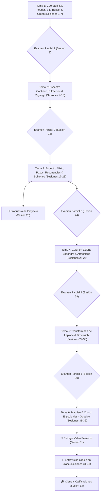

# 🗺️ Map of Content (MoC) — Matemáticas Avanzadas de la Física

Bienvenido al mapa general de contenidos para el curso **Matemáticas Avanzadas de la Física (MAF)** en la Facultad de Ciencias, UNAM. Este mapa interconecta las 33 sesiones del curso, los conceptos teóricos, las funciones especiales, los laboratorios computacionales y los 5 exámenes parciales.

---

## 🧭 Estructura General del Curso (6 Temas Oficiales & 5 Parciales)

---

## 📦 Tema 1: Cuerda Finita, Series de Fourier, Sturm-Liouville, Bessel y Green (Sesiones 1 a 8)

- **Sesiones**:
  - [[Lectures/Sesion_01_Presentacion_Cuerda_Vibrante|Sesión 1: Presentación, Cuerda Vibrante y Separación de Variables]]
  - [[Lectures/Sesion_02_Series_Fourier|Sesión 2: Series de Fourier y Desarrollo de Funciones]]
  - [[Lectures/Sesion_03_Sturm_Liouville|Sesión 3: Problema General de Sturm-Liouville y Bases Completas]]
  - [[Lectures/Sesion_04_Membranas_Circulares_Bessel|Sesión 4: Membranas Circulares e Introducción a Funciones de Bessel]]
  - [[Lectures/Sesion_05_Propiedades_Bessel|Sesión 5: Propiedades Nodales, Soluciones Singulares y Orden Fraccionario]]
  - [[Lectures/Sesion_06_Series_Fourier_Bessel|Sesión 6: Membranas Sectoriales y Series de Fourier-Bessel en Julia/Python]]
  - [[Lectures/Sesion_07_Funciones_Green_1D|Sesión 7: Operadores Inversos, Función de Green 1D y Delta de Dirac]]
  - [[Lectures/Sesion_08_Examen_Parcial_1|Sesión 8: 📝 Examen Parcial 1 (Tema 1 – 10%)]]
- **Conceptos Teóricos**:
  - [[Concepts/Bloque_01/Cuerda_Vibrante_Separacion_Variables|Cuerda Vibrante y Separación de Variables]]
  - [[Concepts/Bloque_01/Series_Fourier|Series de Fourier y Ortogonalidad]]
  - [[Concepts/Bloque_01/Problema_Sturm_Liouville|Operadores y Problema de Sturm-Liouville]]
  - [[Concepts/Bloque_01/Funciones_Bessel|Funciones de Bessel ($J_\nu, Y_\nu$)]]
  - [[Concepts/Bloque_01/Series_Fourier_Bessel|Series de Fourier-Bessel]]
  - [[Concepts/Bloque_01/Funcion_Green_1D|Funciones de Green 1D y Distribuciones]]
- **Laboratorio**:
  - `Notebooks/Python/01_Fourier_Bessel_Series.ipynb`

---

## 🌊 Tema 2: Vibración en Regiones Infinitas, Espectro Continuo y Difracción (Sesiones 9 a 16)

- **Sesiones**:
  - [[Lectures/Sesion_09_Cuerda_Semiinfinita_Espectro_Continuo|Sesión 9: Cuerda Semiinfinita y Espectro Continuo]]
  - **Sesión 10**: Funciones propias generalizadas y transformadas de Fourier como límite del espectro discreto.
  - **Sesión 11**: Reflexión de olas en playas y representación integral compleja de Bessel.
  - **Sesión 12**: Asintótica de Bessel y representación espectral del operador en el continuo.
  - **Sesión 13**: Difracción electromagnética por un cilindro y funciones de Bessel modificadas.
  - **Sesión 14**: El azul del cielo (difracción de Rayleigh) y sección eficaz de dispersión.
  - **Sesión 15**: Taller computacional de difracción y dispersión en Colab.
  - **Sesión 16**: 🎯 **Examen Parcial 2 (Tema 2 – 10%)** *(Formulario manuscrito +1 pt)*
- **Conceptos Teóricos**:
  - [[Concepts/Bloque_02/Cuerda_Semiinfinita_Espectro_Continuo|Espectro Continuo y Cuerda Semiinfinita]]
  - [[Concepts/Bloque_02/Transformada_Fourier_Continuo|Transformada de Fourier como Límite Espectral]]
  - [[Concepts/Bloque_02/Asintotica_Bessel_Integrales_Complejas|Representación Integral y Asintótica de Bessel]]
  - [[Concepts/Bloque_02/Difraccion_Cilindro_Bessel_Modificadas|Difracción Cilíndrica y Bessel Modificadas]]
  - [[Concepts/Bloque_02/Difraccion_Rayleigh_Seccion_Eficaz|Difracción de Rayleigh y Sección Eficaz]]

---

## ⚛️ Tema 3: Espectro Mixto, Pozos Cuánticos, Resonancias y Solitones (Sesiones 17 a 24)

- **Sesiones**:
  - **Sesión 17**: Pozo de potencial cuántico: estados ligados vs estados libres.
  - **Sesión 18**: Representación espectral completa: suma sobre discretos + integración continua.
  - **Sesión 19**: Potenciales sin reflexión y ondas solitarias (KdV).
  - **Sesión 20**: Ondas elásticas acopladas con estructuras vibrantes.
  - **Sesión 21**: Atrapamiento de energía y resonancias.
  - **Sesión 22**: Amortiguamiento por radiación y polos del operador resolvente.
  - **Sesión 23**: 📌 **Entrega de Propuesta de Proyecto** *(10% del Proyecto)*. Repaso general.
  - **Sesión 24**: 🎯 **Examen Parcial 3 (Tema 3 – 10%)** *(Formulario manuscrito +1 pt)*
- **Conceptos Teóricos**:
  - [[Concepts/Bloque_03/Pozo_Potencial_Estados_Ligados_Libres|Estados Ligados y Estados del Continuo]]
  - [[Concepts/Bloque_03/Representacion_Espectral_Mixta|Teoría Espectral Mixta]]
  - [[Concepts/Bloque_03/Potenciales_Reflexion_Cero_Solitones|Potenciales Pöschl-Teller y Solitones]]
  - [[Concepts/Bloque_03/Resonancias_Polos_Resolvente|Polos del Operador Resolvente y Resonancias]]

---

## 🌍 Tema 4: Calentamiento de la Tierra, Legendre y Armónicos Esféricos (Sesiones 25 a 28)

- **Sesiones**:
  - **Sesión 25**: Conducción de calor en una esfera (calentamiento de la Tierra).
  - **Sesión 26**: Polinomios armónicos y deducción de la ecuación de Legendre.
  - **Sesión 27**: Propiedades de ortogonalidad, asintótica de Legendre y armónicos esféricos.
  - **Sesión 28**: 🎯 **Examen Parcial 4 (Tema 4 – 10%)** *(Formulario manuscrito +1 pt)*
- **Conceptos Teóricos**:
  - [[Concepts/Bloque_04/Conduccion_Calor_Esfera|Ecuación de Calor en Coordenadas Esféricas]]
  - [[Concepts/Bloque_04/Polinomios_Legendre|Polinomios de Legendre ($P_n(x)$) y Armónicos Esféricos]]

---

## ⚡ Tema 5: Transformada de Laplace y Propagación de Frentes de Onda (Sesiones 29 a 30)

- **Sesiones**:
  - **Sesión 29**: Transformada de Laplace para problemas de valor inicial y contorno; velocidad finita de propagación.
  - **Sesión 30**: Inversión en contorno de Bromwich, velocidad de señal vs. grupo, precursores + 🎯 **Examen Parcial 5 (Tema 5 – 10%)**.
- **Conceptos Teóricos**:
  - [[Concepts/Bloque_05/Transformada_Laplace_Ondas|Transformada de Laplace en EDPs de Ondas]]
  - [[Concepts/Bloque_05/Inversion_Bromwich_Velocidad_Grupo_Senal|Contorno de Bromwich, Velocidad de Señal y Precursores]]

---

## 🌀 Tema 6: Ecuación de Mathieu, Estabilidad y Entrevistas Orales (Sesiones 31 a 33)

- **Sesiones**:
  - **Sesión 31**: Ecuación de Mathieu y zonas de estabilidad (Contenido optativo / no evaluable) + 📌 **Entrega de Video del Proyecto** + Primer bloque de entrevistas orales individuales.
  - **Sesión 32**: Separación de variables en coordenadas elipsoidales y problemas de potencial + Segundo bloque de entrevistas orales.
  - **Sesión 33**: 🎓 **Cierre del curso**, conclusión de entrevistas y entrega de calificaciones.
- **Conceptos Teóricos**:
  - [[Concepts/Bloque_06/Ecuacion_Mathieu_Estabilidad|Ecuación de Mathieu y Resonancia Paramétrica]]
  - [[Concepts/Bloque_06/Separacion_Variables_Coordenadas_Elipsoidales|Separación de Variables en Coordenadas Elipsoidales]]

---

## 📚 Bibliografía (Temario Oficial)

### Básica
- [[Sources/Books/Arfken_1966|Arfken, G. B. (1966) - Mathematical Methods for Physicists]]
- [[Sources/Books/Lebedev_1970|Lebedev, N. N. (1970) - Special Functions and Their Applications]]
- Friedman, B. (1956) - *Principles and Techniques of Applied Mathematics*
- Keener, A. (1988) - *Principles of Applied Mathematics*
- Weinberger, H. F. (1969) - *Partial Differential Equations*
- Whittaker, E. T. & Watson, G. N. (1927) - *A Course in Modern Analysis*

### Complementaria
- Courant, R. & Hilbert, D. (1989) - *Mathematical Methods of Physics*
- Jeffreys, H. & Jeffreys, B. (1946) - *Mathematical Physics*
- Kevorkian, J. (1980, 1990) - *Perturbation Methods / PDEs*
