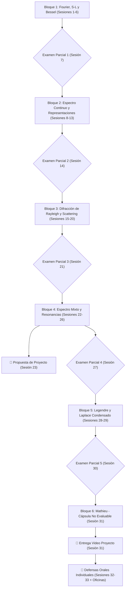

# 🗺️ Map of Content (MoC) — Matemáticas Avanzadas de la Física

Bienvenido al mapa general de contenidos para el curso **Matemáticas Avanzadas de la Física (MAF)** en la Facultad de Ciencias, UNAM. Este mapa interconecta las 33 sesiones del curso, los conceptos teóricos, las funciones especiales, los laboratorios computacionales y los 5 exámenes parciales.

---

## 🧭 Estructura General del Curso (6 Bloques Temáticos & 5 Parciales)

---

## 📦 Bloque 1: Fourier, Sturm-Liouville y Bessel (Sesiones 1 a 6)

- **Sesiones**:
  - [[Lectures/Sesion_01_Presentacion_Cuerda_Vibrante|Sesión 1: Presentación, Cuerda Vibrante y Separación de Variables]]
  - [[Lectures/Sesion_02_Series_Fourier|Sesión 2: Series de Fourier y Desarrollo de Funciones]]
  - [[Lectures/Sesion_03_Sturm_Liouville|Sesión 3: Problema General de Sturm-Liouville y Bases Completas]]
  - [[Lectures/Sesion_04_Membranas_Circulares_Bessel|Sesión 4: Membranas Circulares e Introducción a Funciones de Bessel]]
  - [[Lectures/Sesion_05_Propiedades_Bessel|Sesión 5: Propiedades Nodales, Soluciones Singulares y Orden Fraccionario]]
  - [[Lectures/Sesion_06_Series_Fourier_Bessel|Sesión 6: Membranas Sectoriales, Fourier-Bessel en Julia/Python y Función de Green 1D]]
  - **Sesión 7**: 🎯 **Examen Parcial 1** *(Formulario manuscrito +1 pt)*
- **Conceptos Teóricos**:
  - [[Concepts/Bloque_01/Cuerda_Vibrante_Separacion_Variables|Cuerda Vibrante y Separación de Variables]]
  - [[Concepts/Bloque_01/Series_Fourier|Series de Fourier y Ortogonalidad]]
  - [[Concepts/Bloque_01/Problema_Sturm_Liouville|Operadores y Problema de Sturm-Liouville]]
  - [[Concepts/Bloque_01/Funciones_Bessel|Funciones de Bessel ($J_\nu, Y_\nu$)]]
  - [[Concepts/Bloque_01/Series_Fourier_Bessel|Series de Fourier-Bessel]]
  - [[Concepts/Bloque_01/Funcion_Green_1D|Funciones de Green 1D y Distribuciones]]
- **Laboratorio**:
  - `Notebooks/Python/01_Fourier_Bessel_Series.ipynb`

---

## 🌊 Bloque 2: Espectro Continuo, Representaciones Integrales y Transformada de Fourier (Sesiones 8 a 13)

- **Sesiones**:
  - **Sesión 8**: Cuerda semiinfinita, ondas incidentes/reflejadas y concepto de espectro continuo.
  - **Sesión 9**: Funciones propias generalizadas y transformadas de Fourier como límite del espectro discreto.
  - **Sesión 10**: Reflexión de olas en playas y representación integral en el plano complejo de funciones de Bessel.
  - **Sesión 11**: Asintótica de funciones de Bessel y representación espectral de operadores en el continuo.
  - **Sesión 12**: Difracción de ondas electromagnéticas por un cilindro y funciones de Bessel modificadas.
  - **Sesión 13**: Taller computacional: Simulación de patrones de difracción y dispersión en Google Colab.
  - **Sesión 14**: 🎯 **Examen Parcial 2** *(Formulario manuscrito +1 pt)*
- **Conceptos Teóricos**:
  - [[Concepts/Bloque_02/Cuerda_Semiinfinita_Espectro_Continuo|Espectro Continuo y Cuerda Semiinfinita]]
  - [[Concepts/Bloque_02/Transformada_Fourier_Continuo|Transformada de Fourier como Límite Espectral]]
  - [[Concepts/Bloque_02/Asintotica_Bessel_Integrales_Complejas|Representación Integral y Asintótica de Bessel]]
  - [[Concepts/Bloque_02/Difraccion_Cilindro_Bessel_Modificadas|Difracción Cilíndrica y Bessel Modificadas]]

---

## 🌈 Bloque 3: Difracción de Rayleigh y Secciones Eficaces (Sesiones 15 a 20)

- **Sesiones**:
  - **Sesión 15**: Difracción de Rayleigh ("el azul del cielo") y sección eficaz de dispersión.
  - **Sesión 16**: Desarrollo multipolar y funciones de Bessel esféricas.
  - **Sesión 17**: Problemas de scattering en 2D y 3D (Aproximaciones de Born y ondas parciales).
  - **Sesión 18**: Taller computacional avanzado: Simulación de patrones de Rayleigh en Colab.
  - **Sesión 19**: Aplicaciones a física atmosférica y óptica (repaso de Fourier y Bessel).
  - **Sesión 20**: Repaso general del Bloque 3 y resolución de problemas tipo examen.
  - **Sesión 21**: 🎯 **Examen Parcial 3** *(Formulario manuscrito +1 pt)*
- **Conceptos Teóricos**:
  - [[Concepts/Bloque_02/Difraccion_Rayleigh_Seccion_Eficaz|Difracción de Rayleigh y Sección Eficaz]]

---

## ⚛️ Bloque 4: Espectro Mixto en Mecánica Cuántica y Clásica (Sesiones 22 a 26)

- **Sesiones**:
  - **Sesión 22**: El pozo de potencial cuántico: estados ligados vs estados libres.
  - **Sesión 23**: 📌 **Entrega de Propuesta de Proyecto con Justificación (10% del Proyecto - 4% Final)**.
  - **Sesión 24**: Representación espectral completa combinando suma sobre discretos e integración continua.
  - **Sesión 25**: Potenciales reflexión cero y ondas solitarias (conexión KdV). Ondas elásticas acopladas.
  - **Sesión 26**: Atrapamiento de energía, resonancias y amortiguamiento por radiación (polos del resolvente).
  - **Sesión 27**: 🎯 **Examen Parcial 4** *(Formulario manuscrito +1 pt)*
- **Conceptos Teóricos**:
  - [[Concepts/Bloque_03/Pozo_Potencial_Estados_Ligados_Libres|Estados Ligados y Estados del Continuo]]
  - [[Concepts/Bloque_03/Representacion_Espectral_Mixta|Teoría Espectral Mixta]]
  - [[Concepts/Bloque_03/Potenciales_Reflexion_Cero_Solitones|Potenciales Pöschl-Teller y Solitones]]
  - [[Concepts/Bloque_03/Resonancias_Polos_Resolvente|Polos del Operador Resolvente y Resonancias]]

---

## 🌍 Bloque 5: Calor en la Tierra, Legendre y Transformada de Laplace (Sesiones 28 a 29) — *Condensado*

- **Sesiones**:
  - **Sesión 28**: Conducción de calor en una esfera (Calentamiento de la Tierra), polinomios armónicos y deducción de Legendre.
  - **Sesión 29**: Transformada de Laplace, velocidad finita de propagación e inversión en contorno de Bromwich.
  - **Sesión 30**: 🎯 **Examen Parcial 5** *(Formulario manuscrito +1 pt)*
- **Conceptos Teóricos**:
  - [[Concepts/Bloque_04/Conduccion_Calor_Esfera|Ecuación de Calor en Coordenadas Esféricas]]
  - [[Concepts/Bloque_04/Polinomios_Legendre|Polinomios de Legendre ($P_n(x)$) y Armónicos Esféricos]]
  - [[Concepts/Bloque_05/Transformada_Laplace_Ondas|Transformada de Laplace en EDPs de Ondas]]
  - [[Concepts/Bloque_05/Inversion_Bromwich_Velocidad_Grupo_Senal|Contorno de Bromwich, Velocidad de Señal y Precursores]]

---

## 🌀 Bloque 6: Ecuación de Mathieu & Defensas de Proyecto (Sesiones 31 a 33)

- **Sesiones**:
  - **Sesión 31**: Ecuación de Mathieu y zonas de estabilidad (Cápsula no evaluable) + 📌 **Entrega de Video del Proyecto (16% Final)**.
  - **Sesión 32**: 🎤 **Defensas Orales Individuales (1ra ronda - 10 min exposición + 5 min preguntas)**.
  - **Sesión 33**: 🎤 **Defensas Orales Individuales (2da ronda) y Cierre del Curso** *(defensas restantes en horarios de oficina)*.
- **Conceptos Teóricos**:
  - [[Concepts/Bloque_06/Ecuacion_Mathieu_Estabilidad|Ecuación de Mathieu y Resonancia Paramétrica]]

---

## 📚 Bibliografía de Referencia

- [[Sources/Books/Arfken_1966|Arfken, G. B. (1966) - Mathematical Methods for Physicists]]
- [[Sources/Books/Lebedev_1970|Lebedev, N. N. (1970) - Special Functions and Their Applications]]
