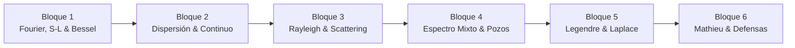

# 📐 Matemáticas Avanzadas de la Física (MAF)
**Facultad de Ciencias, UNAM — Semestre 2027-1**  
**Profesor:** Dr. Roberto Antonio Zamora Zamora (`roberto.zamorazamora@ciencias.unam.mx`)  
**Horario:** Martes y Jueves (2.5 horas por clase — 33 sesiones efectivas)

Bienvenido a la plataforma interactiva de notas, mapas de contenido, código numérico y grafos de conocimiento del curso.

---

## 🧭 Accesos Rápidos Principales

- 📋 **[[Syllabus]]**: Temario oficial, calendario sintético (33 sesiones), esquema de evaluación (50% Exámenes [5 parciales, se descarta el más bajo] / 40% Proyecto [Propuesta + Video + Defensa] / 10% Forms), política de IA y bibliografía base.
- 🗺️ **[[MoC/MAF_MoC|Mapa de Contenido (MoC)]]**: Índice interactivo y grafo temático de los 6 bloques y 33 sesiones del curso.
- 🎓 **[[Projects/Final_Project_Guide|Proyecto Final (40%)]]**: Guía de entregas, propuesta con justificación (Sesión 23), video y código (Sesión 31) y defensas orales individuales (Sesiones 32–33 + horarios de oficina).
- 💻 **[[Notebooks/README|Laboratorios en Google Colab]]**: Cuadernos interactivos en **Python** y **Julia** (Series de Fourier-Bessel, dispersión de Rayleigh, zonas de estabilidad de Mathieu).
- 📚 **Bibliografía**: [[Sources/Books/Arfken_1966|Arfken (1966)]] y [[Sources/Books/Lebedev_1970|Lebedev (1970)]].

---

## 📦 Bloques Temáticos del Curso

1. **[[MoC/MAF_MoC#bloque-1-fourier-sturm-liouville-y-bessel-sesiones-1-a-6|Bloque 1: Fourier, Sturm-Liouville y Bessel]]** *(Sesiones 1 – 6 | 📝 Examen Parcial 1: Sesión 7)*
2. **[[MoC/MAF_MoC#bloque-2-espectro-continuo-representaciones-integrales-y-transformada-de-fourier-sesiones-8-a-13|Bloque 2: Espectro Continuo y Representaciones Integrales]]** *(Sesiones 8 – 13 | 📝 Examen Parcial 2: Sesión 14)*
3. **[[MoC/MAF_MoC#bloque-3-difracción-de-rayleigh-y-secciones-eficaces-sesiones-15-a-20|Bloque 3: Difracción de Rayleigh y Secciones Eficaces]]** *(Sesiones 15 – 20 | 📝 Examen Parcial 3: Sesión 21)*
4. **[[MoC/MAF_MoC#bloque-4-espectro-mixto-en-mecánica-cuántica-y-clásica-sesiones-22-a-26|Bloque 4: Espectro Mixto, Pozos y Resonancias]]** *(Sesiones 22 – 26 | 📌 Propuesta: Sesión 23 | 📝 Examen Parcial 4: Sesión 27)*
5. **[[MoC/MAF_MoC#bloque-5-calor-en-la-tierra-legendre-y-transformada-de-laplace-sesiones-28-a-29-condensado|Bloque 5: Calor, Legendre y Laplace (Condensado)]]** *(Sesiones 28 – 29 | 📝 Examen Parcial 5: Sesión 30)*
6. **[[MoC/MAF_MoC#bloque-6-ecuación-de-mathieu-defensas-de-proyecto-sesiones-31-a-33|Bloque 6: Cápsula Mathieu (No Evaluable) & Defensas Orales]]** *(Sesión 31: Video | Sesiones 32–33: Defensas Orales)*

---

*Sitio web generado automáticamente con Obsidian + Quartz.*
