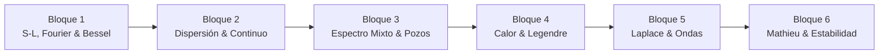

# 📐 Matemáticas Avanzadas de la Física (MAF)
**Facultad de Ciencias, UNAM — Semestre 2027-1**  
**Profesor:** Dr. Roberto Antonio Zamora Zamora (`roberto.zamorazamora@ciencias.unam.mx`)  
**Horario:** Martes y Jueves (2.5 horas por clase — 33 sesiones efectivas)

Bienvenido a la plataforma interactiva de notas, mapas de contenido, código numérico y grafos de conocimiento del curso.

---

## 🧭 Accesos Rápidos Principales

- 📋 **[[Syllabus]]**: Temario oficial, calendario sintético (33 sesiones), esquema de evaluación (50% Exámenes / 40% Proyecto / 10% Forms), política de IA y bibliografía base.
- 🗺️ **[[MoC/MAF_MoC|Mapa de Contenido (MoC)]]**: Índice interactivo y grafo temático de los 6 bloques y 33 sesiones del curso.
- 🎓 **[[Projects/Final_Project_Guide|Proyecto Final (40%)]]**: Guía de entregas, selección de artículo (Semana 8-9), video (7–15 min) y defensa oral en la Sesión 33.
- 💻 **[[Notebooks/README|Laboratorios en Google Colab]]**: Cuadernos interactivos en **Python** y **Julia** (Series de Fourier-Bessel, dispersión de Rayleigh, zonas de estabilidad de Mathieu).
- 📚 **Bibliografía**: [[Sources/Books/Arfken_1966|Arfken (1966)]] y [[Sources/Books/Lebedev_1970|Lebedev (1970)]].

---

## 📦 Bloques Temáticos del Curso

1. **[[MoC/MAF_MoC#bloque-1-cuerda-finita-series-de-fourier-y-operadores-de-sturm-liouville-sesiones-1-a-7|Bloque 1: Cuerda finita, Fourier, Bessel y Sturm-Liouville]]** *(Sesiones 1 – 7 | Examen Parcial 1: Sesión 8)*
2. **[[MoC/MAF_MoC#bloque-2-vibración-dispersión-en-regiones-infinitas-y-espectro-continuo-sesiones-9-a-15|Bloque 2: Dispersión en regiones infinitas, espectro continuo y difracción]]** *(Sesiones 9 – 15 | Examen Parcial 2: Sesión 16)*
3. **[[MoC/MAF_MoC#bloque-3-espectro-mixto-en-mecánica-cuántica-y-clásica-sesiones-17-a-23|Bloque 3: Espectro mixto, pozos cuánticos, solitones y resonancias]]** *(Sesiones 17 – 23 | Examen Parcial 3: Sesión 24)*
4. **[[MoC/MAF_MoC#bloque-4-calor-en-la-tierra-geometría-esférica-y-legendre-sesiones-25-a-28|Bloque 4: Calor en la Tierra, geometría esférica y Legendre]]** *(Sesiones 25 – 28)*
5. **[[MoC/MAF_MoC#bloque-5-transformada-de-laplace-y-frentes-de-onda-sesiones-29-a-30|Bloque 5: Transformada de Laplace y propagación de frentes de onda]]** *(Sesiones 29 – 30)*
6. **[[MoC/MAF_MoC#bloque-6-funciones-de-mathieu-estabilidad-y-cierre-sesiones-31-a-33|Bloque 6: Funciones de Mathieu, estabilidad y Cierre]]** *(Sesiones 31 – 33)*

---

*Sitio web generado automáticamente con Obsidian + Quartz.*
